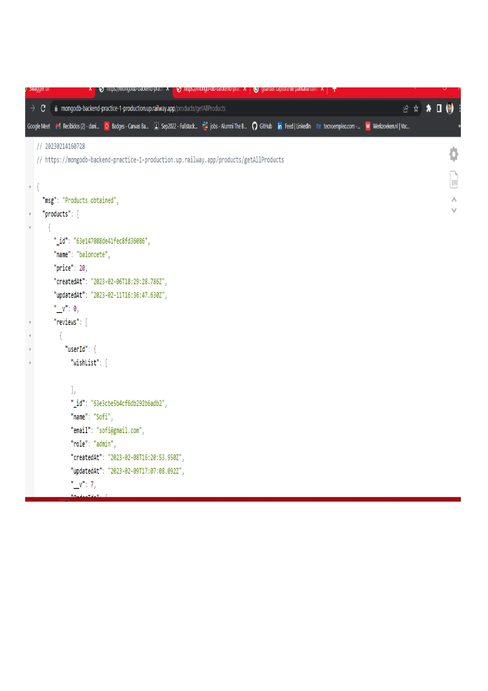
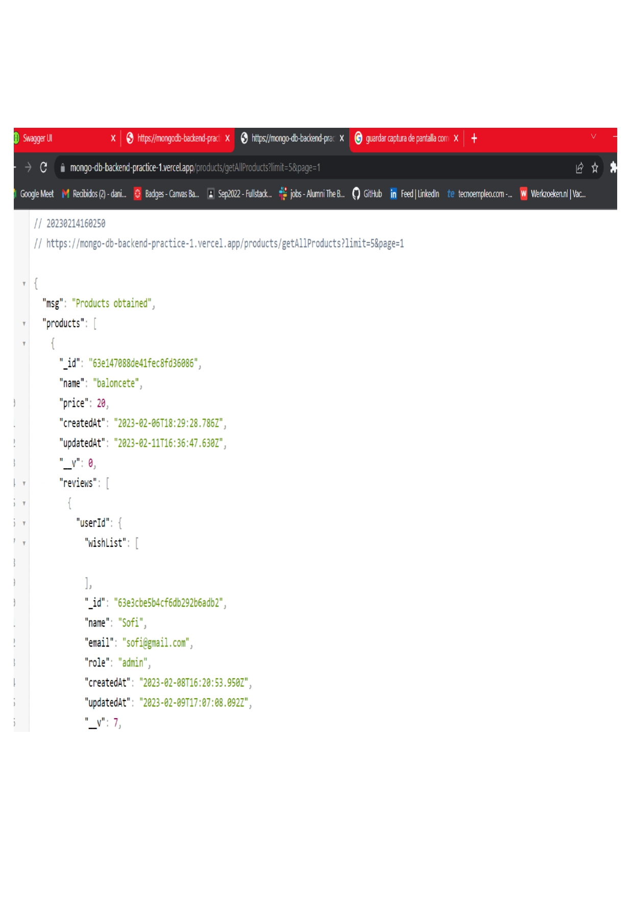
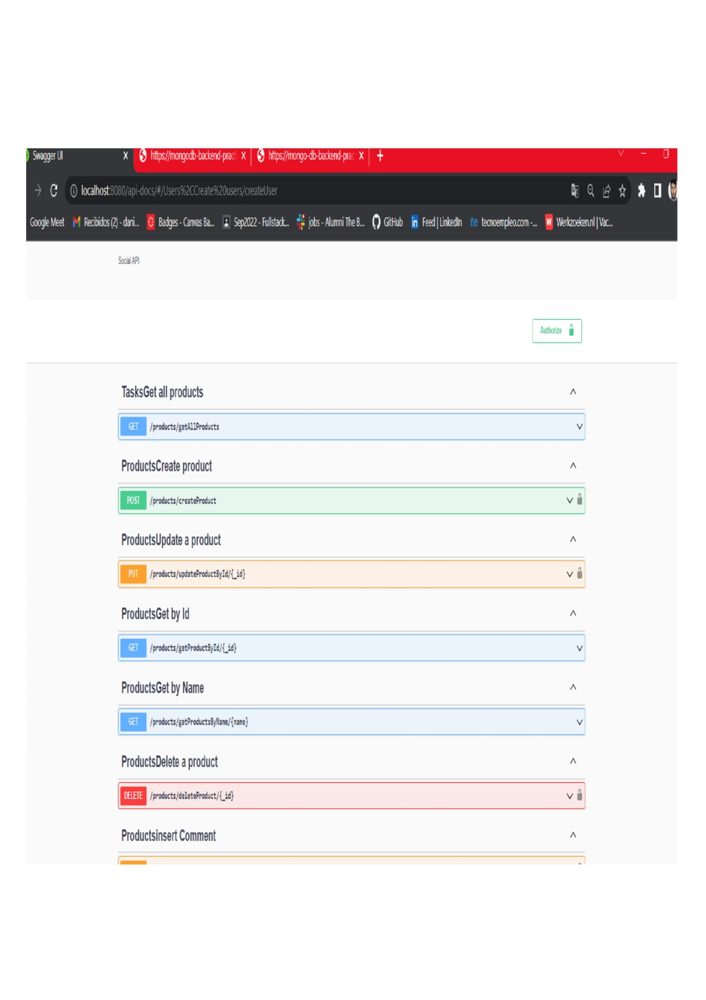

# DANIEL MIGUELEZ MONGO DB PRACTICE 🥰

In this small project that I have made, I have used MongoDB, and also Mongoose to create my database, in here you can appreciate that I have, Users, Products, and Orders, and It is possibel also to comment the products, in case that you have liked it or not, it is also possible to put them into your wishlist.

Once ended the backend practice, it is expcted that I'll know haw to do the following things: 

1. Register an user usin Bcrypt.
2. Login users + token + middleware.
3. To be able to create a CRUD.
4. To give and delete a like from a post.
5. To deploy a backend in Railway and in Vercel.
6. To document every endpoint in swagger.
7. Document every endpoint in postman.

### Another things that I have done during this project..
 1. Use git branches, at the end the 2 branches remaining should be the main branch and the develop.
 2. Excellent README has to be done.

#### Technologies that I have used for this project: 🤖

I have used the following technologies in this project:

1. NODE  
2. EXPRESS
3. MONGODB
4. MONGOOSE

### POSTMAN GIF

In here you can see how POSTMAN works, I documented every endpoint that I have made to see if it workds, I made relations between the component Users, Orders, And Products.

### IMAGES DEPLOYING WITH RAILWAY AND VERCEL.

1. In the first one I deployed the users to make an example with Railway, I leave the URL so you can see it in here:

https://mongodb-backend-practice-1-production.up.railway.app/products/getAllProducts

2. In this one the deployment has been done with vercel, It works the same way, but the URL is this one: 

https://mongo-db-backend-practice-1.vercel.app/products/getAllProducts?limit=5&page=1

3. And the last one I documented the endpoints, this time with Products, you can see them in here.

Project developed by Daniel Miguelez [https://github.com/DanielMiguelez]
